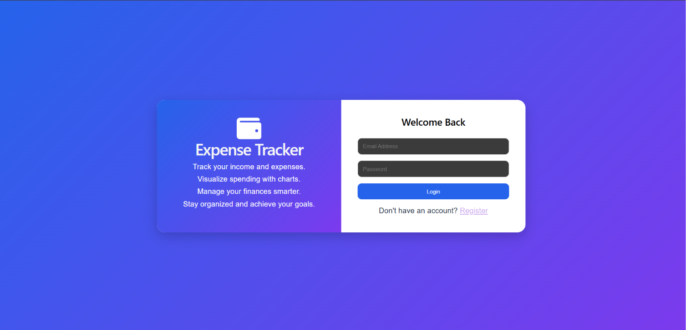
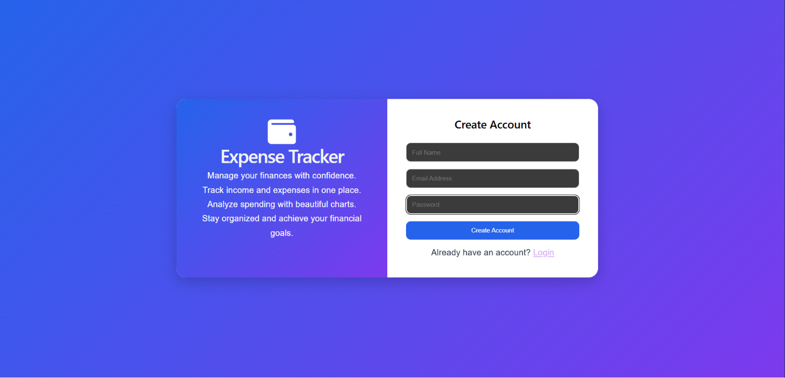
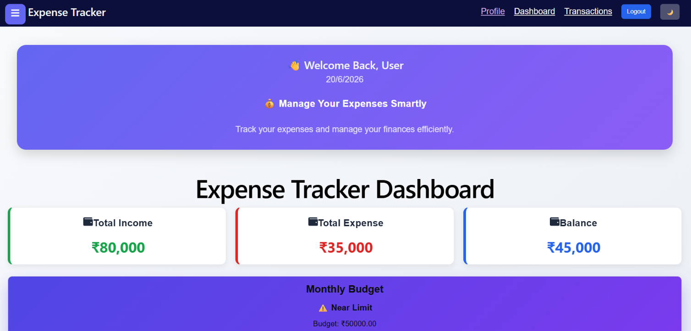
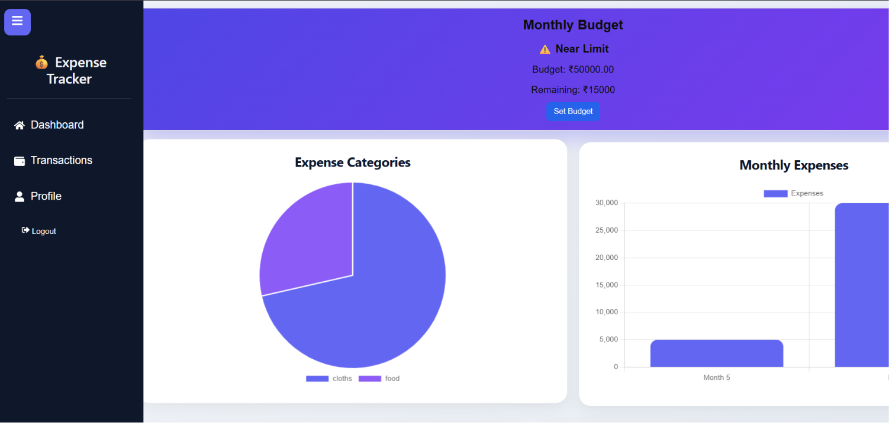
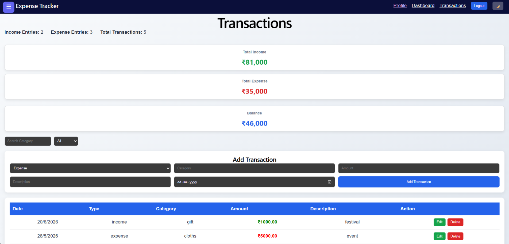
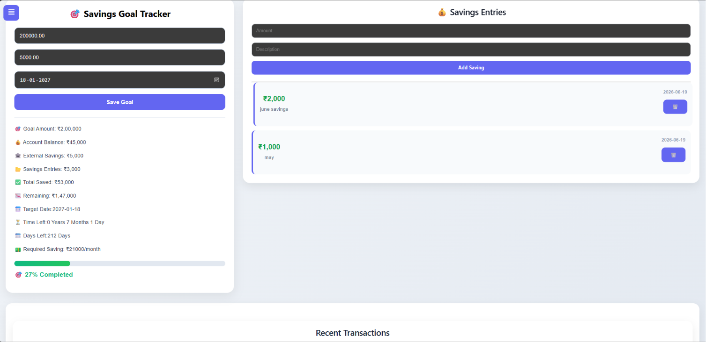
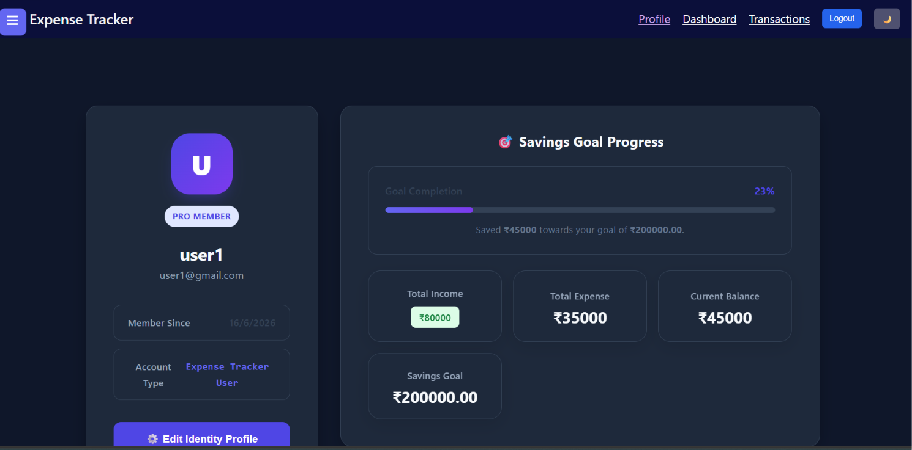

# 💰 Expense Tracker

## Internship Submission

 - **Intern ID:** CITS1751
 - **Full Name:** KOTA SRAVANTHI
 - **No. of Weeks:** 8 Weeks 
 - **Project Name:** Expense Tracker – Personal Finance Management System
 - **Domain**: Full Stack Web Development

## Project Scope

A full-stack Expense Tracker application that helps users manage income, expenses, budgets, and savings goals through an interactive dashboard.

## 🚀 Features

### Authentication
- User Registration
- User Login with JWT Authentication
- Protected Routes
- User Profile Management

### Login and Registration Pages
<p align="center">
  
  
</p>

### Dashboard
- Total Income Overview
- Total Expense Overview
- Current Balance Calculation
- Expense Category Pie Chart
- Monthly Expense Bar Chart
- Recent Transactions Widget
- Welcome Banner
- Dark Mode Support

### Dashboard

<p align="center">
  
  
</p>


### Transactions
- Add Income Transactions
- Add Expense Transactions
- Edit Transactions
- Delete Transactions
- Categorize Expenses
- Transaction History

### Transactions

<p align="center">
  
</p>


### Budget Management
- Set Monthly Budget
- Track Spending Against Budget
- Budget Progress Monitoring

### Savings Goal Tracker
- Create Savings Goals
- Set Target Amount
- Set Target Date
- Track Goal Completion Percentage
- Calculate Remaining Amount
- Calculate Required Monthly Savings
- Days/Months/Years Remaining

### Savings Entries
- Add External Savings Entries
- View Savings History
- Delete Savings Entries
- Automatic Goal Progress Updates

<p align="center">
  
</p>

### Profile
- View User Information
- Edit Profile Details
- Account Statistics
- Dark Mode Preferences

### Profile

<p align="center">
  
</p>


## 🎥 Demo Video

[Watch the Demo Video](demo/video.mp4)

## 📄 Documentation

Project Documentation:

[Expense Tracker Documentation](documentation/ExpenseTracker.docx)

## 🛠️ Tech Stack

### Frontend
- React.js
- React Router DOM
- Axios
- Chart.js
- React ChartJS 2
- React Icons
- CSS

### Backend
- Node.js
- Express.js
- JWT Authentication
- bcryptjs

### Database
- MySQL

## 📂 Project Structure

```text
expense-tracker/
│
├── frontend/
│   ├── src/
│   │   ├── components/
│   │   ├── pages/
│   │   ├── services/
│   │   ├── styles/
│   │   └── App.jsx
│
├── backend/
│   ├── controllers/
│   ├── routes/
│   ├── middleware/
│   ├── config/
│   └── server.js
│
└── README.md
```

## ⚙️ Installation

### 1. Clone Repository

```bash
git clone <repository-url>
cd expense-tracker
```

### 2. Backend Setup

```bash
cd backend
npm install
```

Create a `.env` file:

```env
PORT=5000
DB_HOST=localhost
DB_USER=root
DB_PASSWORD=your_password
DB_NAME=expense_tracker
JWT_SECRET=your_secret_key
```

Start backend:

```bash
npm run dev
```

### 3. Frontend Setup

```bash
cd frontend
npm install
npm run dev
```

Frontend runs at:

```text
http://localhost:5173
```

Backend runs at:

```text
http://localhost:5000
```

## 🗄️ Database

Create a MySQL database:

```sql
CREATE DATABASE expense_tracker;
```

Import your project tables and start the application.

## 📈 Future Enhancements

- Export Reports to PDF
- CSV Download
- Email Notifications
- Mobile Responsive Enhancements
- UPI/Bank Statement Import
- AI Expense Insights
- Multi-Currency Support
- Cloud Deployment

## 🎓 Resume Highlights

This project demonstrates:

- Full Stack Development
- REST API Design
- JWT Authentication
- MySQL Database Design
- Dashboard Development
- Data Visualization
- State Management in React
- CRUD Operations
- Financial Analytics

## 👩‍💻 Author

KOTA SRAVANTHI

Computer Science & Systems Engineering Student

## License

This project is intended for educational and academic purposes.
